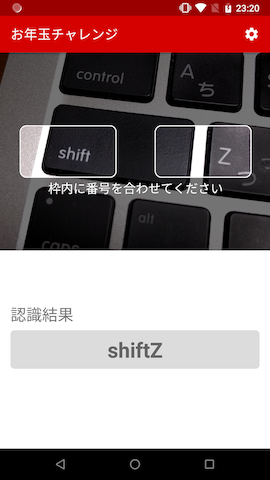
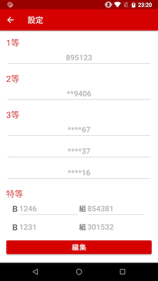

# お年玉チャレンジ

### 概要
年賀状のお年玉くじの番号をカメラでかざすだけで当選しているか判定するアプリ

### 開発環境

### サポートバージョン
Android 5.0 ~ 

### ライブラリ
| 名前 | バージョン | 用途 |
|:-----------|:------------|:------------|
| [CameraX](https://developer.android.com/training/camerax) | 1.0.0-beta01 | カメラ |
| [Material Components for Android](https://github.com/material-components/material-components-android) | 1.1.0 | マテリアルデザイン |
| [Navigation](https://developer.android.com/guide/navigation/navigation-getting-started?hl=ja) | 2.2.1  | 画面遷移 |
| [Firebase ML Vision](https://firebase.google.com/docs/ml-kit/android/recognize-text?hl=ja) | 24.0.1 | 文字認識 |
| [Moshi](https://github.com/square/moshi) | 1.9.2 | JSONデコード/エンコード |

### スクリーンショット

　

